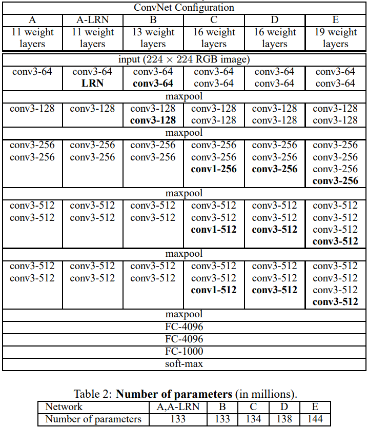
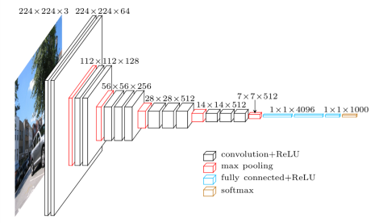
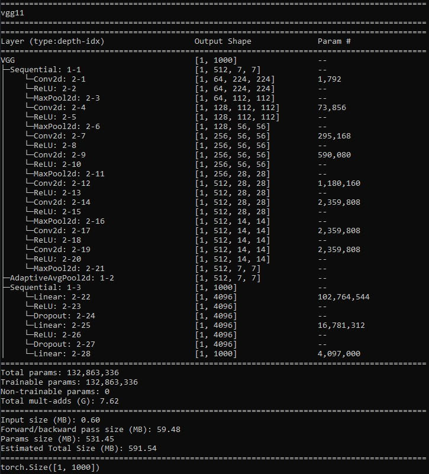
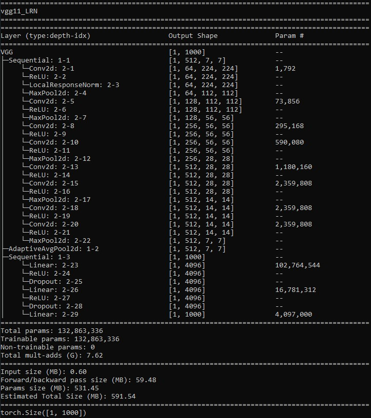
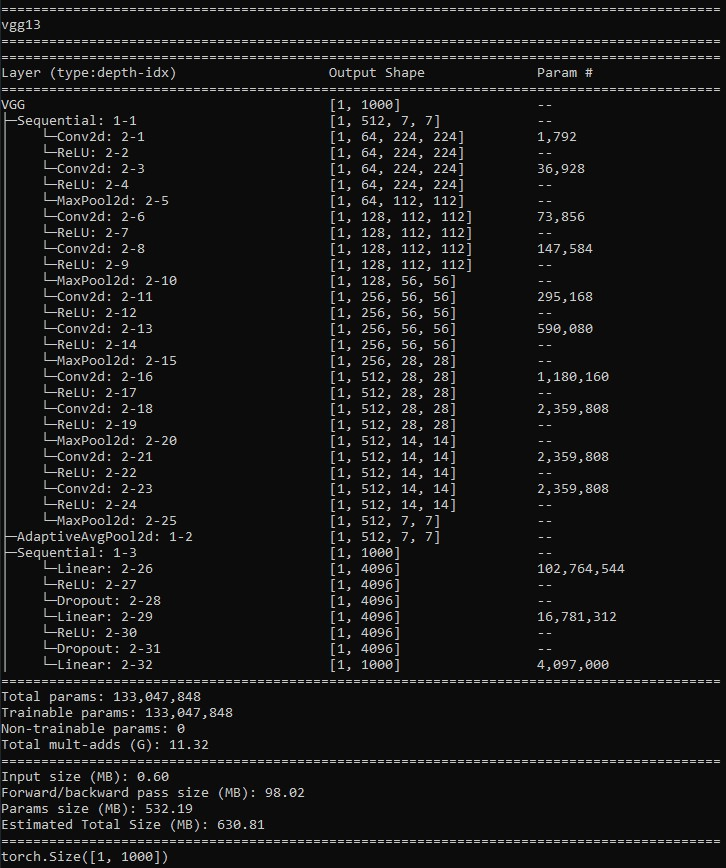
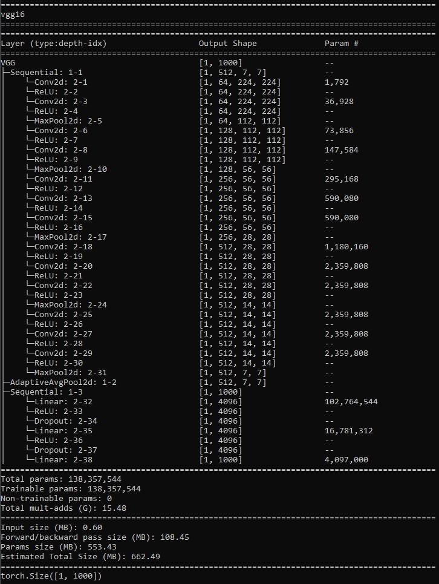
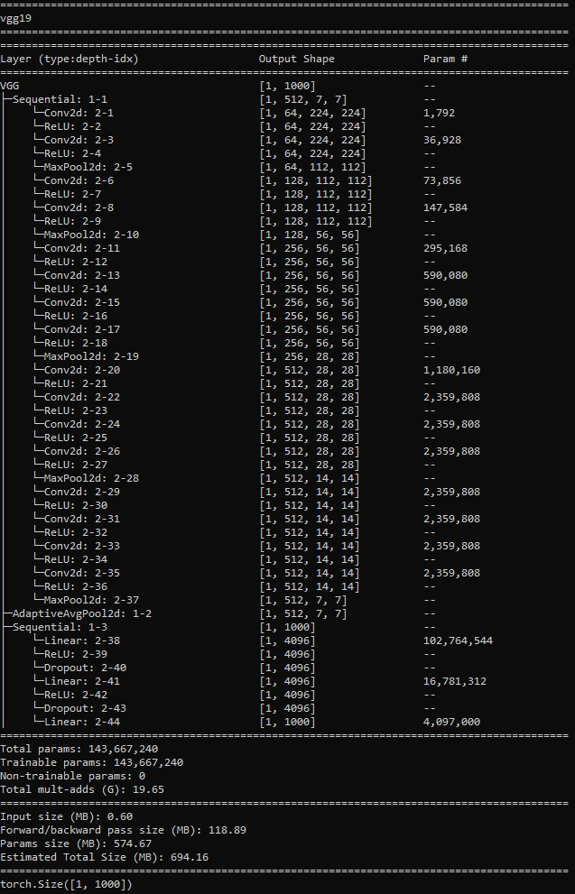

# VGG-Implementation

"Very Deep Convolutional Networks for Large-Scale Image Recognition" by Karen Simonyan and Andrew Zisserman.

Paper: https://arxiv.org/pdf/1409.1556.pdf

## Configuration



## Architecture



## Different day, same old story

GPU POOR !!!

Didn't train cause I don't have a powerful GPU. But the architecture is there for playing.

## Info

Run script below to checkout the model informations

```sh
python info.py
```

### VGG11 (A)



### VGG11_LRN (A-LRN)



### VGG13 (B)




### VGG16_1 (C)


### VGG16 (D)



### VGG19 (E)



## Usage

Before running the script, place your data directory location for both train and test data in `root_dir="{DIR}"` here at [dataloader.py](./dataloader/dataloader.py)

```sh
python train.py --epochs 74 --vgg vgg16
```
